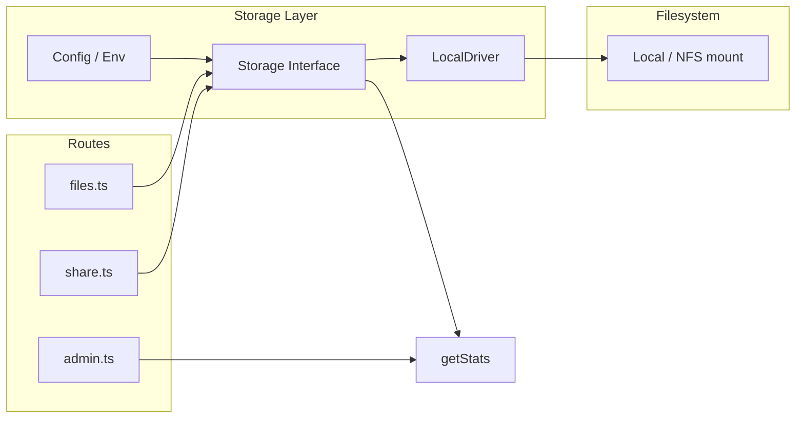

# Rencana Storage: Tergantung Host & Kapasitas Mengikuti Filesystem

## Ringkasan

- **Default**: Tanpa config apa pun, aplikasi memakai **filesystem lokal** (root `./uploads`). Tidak perlu config file.
- **Per host**: Root storage bisa diatur per host lewat env `STORAGE_PATH` atau config opsional (mis. NFS mount path).
- **Kapasitas**: Total/free storage yang tersedia mengikuti filesystem (atau mount) yang dipakai; backend melaporkan statistik dan upload bisa ditolak jika disk penuh.
- **Ke depan**: Abstraksi driver memungkinkan penambahan NFS (via library) atau S3 tanpa mengunci ke filesystem lokal.

---

## 1. Perilaku Default (Tanpa Config)

- **Driver**: `local`
- **Root**: `./uploads` (atau env `STORAGE_PATH` jika di-set)
- User yang tidak rencana pakai S3/NFS **tidak perlu** file config; aplikasi tetap mengikuti filesystem lokal.

---

## 2. Config File (Opsional)

Config hanya dipakai bila ingin mengatur storage secara eksplisit.

- **Lokasi**: `config/storage.json` (atau path dari env `STORAGE_CONFIG_PATH`)
- **Jika file tidak ada** atau tidak valid → dipakai default (local + `./uploads` atau `STORAGE_PATH`)

Contoh isi:

```json
{
  "driver": "local",
  "local": {
    "path": "./uploads"
  }
}
```

- **Env override**: Variabel env (mis. `STORAGE_DRIVER`, `STORAGE_PATH`) bisa mengoverride nilai dari config agar deploy (Docker, PaaS) tetap sederhana.

---

## 3. Total Storage Mengikuti Filesystem

- Backend storage (driver local / NFS mount) mengekspos **statistik filesystem** bila tersedia:
  - **total**: total kapasitas (bytes)
  - **free**: ruang kosong (bytes)
  - **used**: opsional, bisa dihitung dari total - free

- **Sumber data**: Untuk driver `local` (termasuk ketika root adalah NFS mount), statistik diambil dari filesystem root (mis. `fs.statfs` di Node).

- **Penggunaan**:
  - **Admin/dashboard**: Menampilkan “Storage: X GB free of Y GB” (dari backend).
  - **Upload**: Sebelum menyimpan, cek bahwa ruang kosong cukup (mis. tolak upload jika `free < ukuran_file`); ini memastikan total storage yang “tersedia” benar-benar mengikuti filesystem.

- Untuk backend yang tidak punya konsep “disk” (mis. S3 nanti), `getStats()` bisa mengembalikan `null` atau hanya `used`; aplikasi tidak memaksakan limit filesystem.

---

## 4. Abstraksi Driver

- **Interface** (kontrak storage):
  - `save(relativePath, buffer)` → `Promise<StorageResult>`
  - `getStream(relativePath)` → `Promise<Readable>` (untuk download; tidak mengandalkan path filesystem)
  - `delete(relativePath)` → `Promise<boolean>`
  - `exists(relativePath)` → `Promise<boolean>`
  - `getSize(relativePath)` → `Promise<number>`
  - `getStats()` → `Promise<{ total: number; free: number } | null>` (mengikuti filesystem bila ada)

- **Driver local**:
  - Menggunakan `STORAGE_PATH` atau `config.local.path` sebagai root.
  - `getStats()` memakai statistik filesystem (mis. `statfs`) pada root tersebut sehingga total storage yang tersedia mengikuti filesystem (atau NFS mount).

- **NFS**: Untuk NFS yang di-mount di host, cukup set root ke mount point (env atau config); tidak perlu driver NFS khusus. Untuk NFS via library di masa depan, tambah driver yang mengimplementasi interface yang sama.

---

## 5. Alur Singkat



---

## 6. Checklist Implementasi

- [x] Interface storage + tipe `StorageStats` (`total`, `free`).
- [x] LocalDriver: logika saat ini + `getStats()` (statfs pada root).
- [x] Load config opsional dari `config/storage.json` atau env `STORAGE_PATH` / `STORAGE_CONFIG_PATH`; default local.
- [x] Export API lama (`saveFile`, `deleteFile`, dll.) + `getStream`, `getStats`.
- [x] Routes download pakai `getStream(relativePath)` instead of `getFullPath` + `createReadStream`.
- [x] Sebelum upload: jika `getStats()` ada dan `free < fileSize`, tolak upload (507).
- [x] Admin stats: tambah field `storageBackend` (total/free) dari `getStats()` bila ada.

Contoh config: `backend/config/storage.json.example`. Env `STORAGE_PATH` override config.
